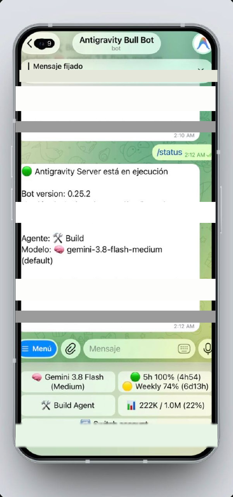

# Antigravity Telegram Bot

[](https://github.com/Heric-Olier/antigravity-telegram-bot/actions/workflows/ci.yml)
[](LICENSE)
[](https://nodejs.org)

A Telegram bot that acts as a mobile client for the [Google Antigravity CLI](https://antigravity.google) (`agy`) over its stream-json wire protocol. Run coding tasks on your own machine, watch the agent work tool-by-tool, and steer it mid-flight — all from a Telegram chat.



## What it is

This is a hardened fork of the [opencode telegram bot by grinev](https://github.com/grinev/opencode-telegram-bot): the OpenCode SDK layer has been replaced with a native driver for Antigravity's `stream-json` NDJSON protocol, keeping grinev's battle-tested Telegram plumbing (sessions, settings, question/permission flows, scheduled tasks).

Single-user by design. The bot talks only to your local `agy` process and the Telegram Bot API — no open ports, no exposed endpoints.

## Features

- **Streaming answers** — assistant replies stream into the chat as they are generated.
- **In-flight hot takeover** — send a follow-up while the agent is still working and the message rides the live `agy` stdin pipe into the running turn, no abort and restart.
- **Live quota badge** — the persistent keyboard shows your 5-hour and weekly quota with exact reset times, refreshed from `agy -p /usage` every 60 seconds.
- **OAuth account switching** — `/switch` + `/code` perform the official Google OAuth flow over the CLI's pty, with keyring backup/restore via `libsecret`.
- **Real context tracker** — context usage measured from actual `agy` usage events (not a guess), survives restarts, reflects auto-compaction.
- **Tasks & schedules** — scheduled prompts with configurable limits and timeouts.
- **Groq voice** — voice messages transcribed and replies spoken back via Groq Whisper STT + TTS.
- **Expandable tool stream** — a `💭 Working…` blockquote expands into the tool-by-tool stream, including subagent activity.
- **Typing indicator from receipt** — the chat action heartbeat starts when your message is received, not after the first event.

## Installation

Requires Node.js ≥ 22 and the [Antigravity CLI](https://antigravity.google) (`agy`) already authenticated on the host.

```bash
# 1. Get the code
git clone https://github.com/Heric-Olier/antigravity-telegram-bot.git
cd antigravity-telegram-bot
npm ci

# 2. Configure
cp .env.example .env
# set TELEGRAM_BOT_TOKEN (from @BotFather) and TELEGRAM_ALLOWED_USER_ID (from @userinfobot)

# 3. Run
npm run build
npm start
```

### systemd (recommended)

```ini
[Unit]
Description=Antigravity Telegram Bot
After=network-online.target

[Service]
Type=simple
WorkingDirectory=/opt/antigravity-telegram-bot
ExecStart=/usr/bin/node dist/index.js
Restart=on-failure
EnvironmentFile=/opt/antigravity-telegram-bot/.env

[Install]
WantedBy=default.target
```

```bash
systemctl --user enable --now antigravity-telegram-bot
```

## The wire: minimal agy stream-json

The bot spawns one long-lived `agy` process per session and speaks NDJSON over stdin/stdout. The minimal exchange:

```
→ {"type":"user","message":{"content":[{"type":"text","text":"<prompt>"}]}}
← {"type":"step_start", ...}
← {"type":"message","role":"assistant","content":[...]}
← {"type":"step_end","usage":{...}}
```

The pipe stays open: an in-flight turn can receive further `user` events (hot takeover), and `usage` events drive the context tracker and quota badge.

## Limitations

- **Thinking text is not exposed** by Google's stream-json output, so reasoning phases surface only as "working" status.
- Quota reset times depend on the `agy -p /usage` report format; CLI updates may require an adapter bump.

## Credits

- [grinev](https://github.com/grinev) — original [opencode-telegram-bot](https://github.com/grinev/opencode-telegram-bot), which this project forks. See [NOTICE](NOTICE).
- [Google Antigravity](https://antigravity.google) and its [CLI documentation](https://antigravity.google/docs/cli/overview) for the `agy` stream-json protocol.

## Commit style

Commits follow [Conventional Commits](https://www.conventionalcommits.org) (`feat:`, `fix:`, `chore:`).
